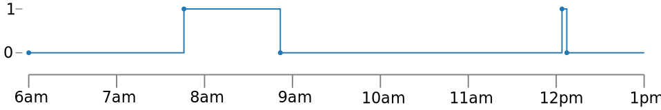

# traces

[](https://pypi.python.org/pypi/traces) [](https://pypi.python.org/pypi/traces) [](https://circleci.com/gh/datascopeanalytics/traces/tree/master) [](https://traces.readthedocs.io/en/master/?badge=master) [](https://coveralls.io/github/datascopeanalytics/traces?branch=master)

A Python library for unevenly-spaced time series analysis.

## Why?

Taking measurements at irregular intervals is common, but most tools are
primarily designed for evenly-spaced measurements. Also, in the real
world, time series have missing observations or you may have multiple
series with different frequencies: it can be useful to model these as
unevenly-spaced.

Traces was designed by the team at
[Datascope](https://datascopeanalytics.com/) based on several practical
applications in different domains, because it turns out [unevenly-spaced
data is actually pretty great, particularly for sensor data
analysis](https://datascopeanalytics.com/blog/unevenly-spaced-time-series/).

## Installation

To install traces, run this command in your terminal:

```bash
$ pip install traces
```

## Quickstart: using traces

To see a basic use of traces, let's look at these data from a light
switch, also known as _Big Data from the Internet of Things_.



The main object in traces is a [TimeSeries](https://traces.readthedocs.io/en/master/api_reference.html#timeseries), which you
create just like a dictionary, adding the five measurements at 6:00am,
7:45:56am, etc.

```python
>>> time_series = traces.TimeSeries()
>>> time_series[datetime(2042, 2, 1,  6,  0,  0)] = 0 #  6:00:00am
>>> time_series[datetime(2042, 2, 1,  7, 45, 56)] = 1 #  7:45:56am
>>> time_series[datetime(2042, 2, 1,  8, 51, 42)] = 0 #  8:51:42am
>>> time_series[datetime(2042, 2, 1, 12,  3, 56)] = 1 # 12:03:56am
>>> time_series[datetime(2042, 2, 1, 12,  7, 13)] = 0 # 12:07:13am
```

What if you want to know if the light was on at 11am? Unlike a python
dictionary, you can look up the value at any time even if it's not one
of the measurement times.

```python
>>> time_series[datetime(2042, 2, 1, 11,  0, 0)] # 11:00am
0
```

The `distribution` function gives you the fraction of time that the
`TimeSeries` is in each state.

```python
>>> time_series.distribution(
>>>   start=datetime(2042, 2, 1,  6,  0,  0), # 6:00am
>>>   end=datetime(2042, 2, 1,  13,  0,  0)   # 1:00pm
>>> )
Histogram({0: 0.8355952380952381, 1: 0.16440476190476191})
```

The light was on about 16% of the time between 6am and 1pm.

### Adding more data...

Now let's get a little more complicated and look at the sensor readings
from forty lights in a house.


How many lights are on throughout the day? The merge function takes the
forty individual `TimeSeries` and efficiently merges them into one
`TimeSeries` where the each value is a list of all lights.

```python
>>> trace_list = [... list of forty traces.TimeSeries ...]
>>> count = traces.TimeSeries.merge(trace_list, operation=sum)
```

We also applied a `sum` operation to the list of states to get the
`TimeSeries` of the number of lights that are on.


How many lights are on in the building on average during business hours,
from 8am to 6pm?

```python
>>> histogram = count.distribution(
>>>   start=datetime(2042, 2, 1,  8,  0,  0),   # 8:00am
>>>   end=datetime(2042, 2, 1,  12 + 6,  0,  0) # 6:00pm
>>> )
>>> histogram.median()
17
```

The `distribution` function returns a [Histogram](https://traces.readthedocs.io/en/master/api_reference.html#histogram) that
can be used to get summary metrics such as the mean or quantiles.

### It's flexible

The measurements points (keys) in a `TimeSeries` can be in any units as
long as they can be ordered. The values can be anything.

For example, you can use a `TimeSeries` to keep track the contents of a
grocery basket by the number of minutes within a shopping trip.

```python
>>> time_series = traces.TimeSeries()
>>> time_series[1.2] = {'broccoli'}
>>> time_series[1.7] = {'broccoli', 'apple'}
>>> time_series[2.2] = {'apple'}          # puts broccoli back
>>> time_series[3.5] = {'apple', 'beets'} # mmm, beets
```

To learn more, check the [examples](https://traces.readthedocs.io/en/master/examples.html) and the detailed [reference](https://traces.readthedocs.io/en/master/api_reference.html#).

## More info

## Contributing

Contributions are welcome and greatly appreciated! Please visit our [guidelines](https://github.com/datascopeanalytics/traces/blob/master/CONTRIBUTING.md)
for more info.
