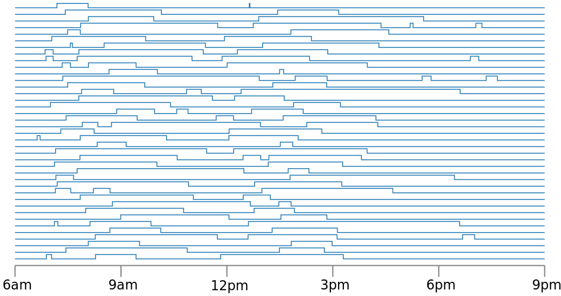
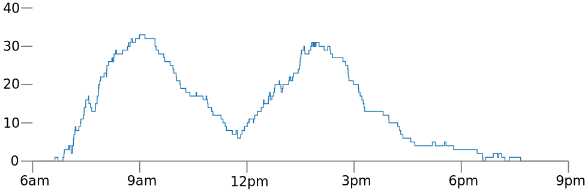

traces
======

Taking measurements at irregular intervals is common, but most tools
for analyzing data over time are designed for regularly-spaced
measurements. Traces aims to make it easy to:

* read, write, and manipulate unevenly-spaced time series data
* perform simple analyses of unevenly-spaced time series data without
  making an awkward / lossy transformation to evenly-spaced
  representations
* gracefully transform unevenly-spaced times series data to
  evenly-spaced representations

### Installation

To install traces, run this command in your terminal:

```bash
$ pip install traces
```

Need more help with installing? See [Installation](installation.md).

### Using traces

To see a simple way to use **traces**, let's look at these data from a
light switch, also known as _Big Data from the Internet of Things_.


You create a `TimeSeries` in traces like you create a dictionary (in
fact, a `TimeSeries` uses the excellent
[sortedcontainers.SortedDict](http://www.grantjenks.com/docs/sortedcontainers/introduction.html#sorteddict)
under the hood).

```python
>>> time_series = traces.TimeSeries()
>>> time_series[datetime(2016, 2, 1,  6,  0,  0)] = 0
>>> time_series[datetime(2016, 2, 1,  7, 45, 56)] = 1
>>> time_series[datetime(2016, 2, 1,  8, 51, 42)] = 0
>>> time_series[datetime(2016, 2, 1, 12,  3, 56)] = 1
>>> time_series[datetime(2016, 2, 1, 12,  7, 13)] = 0
```

Was the light on at 11am? Unlike a python dictionary, you can look up
the value at any time even if it's not one of the measurement times:

```python
>>> time_series[datetime(2016, 2, 1, 11,  0, 0)]
0
```

What is you want to know the fraction of time during the day the light
was on?

```python
>>> time_series.distribution(datetime(2016, 2, 1,  6,  0,  0), datetime(2016, 2, 1,  13,  0,  0))
Histogram({0: 0.8355952380952381, 1: 0.16440476190476191})
```

About 16.4%. How about if you have data from the light switches from a
whole building?



How many lights are on in the building by time of day?

```python
>>> trace_list = [... list of lots of traces.TimeSeries ...]
>>> count = traces.TimeSeries.merge(trace_list, operation=sum)
```



How many lights are on in the building on average during business
hours, from 8am to 6pm?

```python
>>> count.mean(datetime(2016, 2, 1,  8,  0,  0), datetime(2016, 2, 1,  12 + 6,  0,  0))
17.6312415081
```

If you would like to convert an unevenly spaced time series to evenly spaced time series, we also provide two options. If you just want to fill up the blank spaces, you can do:

Additionally, you can do moving average:

<!--TODO: Regularize and moving average example.-->

The measurements points in a TimeSeries can be in any units, as long
as they can be ordered, and the values can be anything. For example,
it could keep track the contents of a grocery basket by the number of
minutes within a shopping trip.

```python
>>> time_series = traces.TimeSeries()
>>> time_series[1.2] = set(['broccoli'])
>>> time_series[1.4] = set(['broccoli', 'orange'])
>>> time_series[1.7] = set(['broccoli', 'orange', 'banana'])
>>> time_series[2.2] = set(['orange', 'banana'])
>>> time_series[3.5] = set(['orange', 'banana', 'beets'])
```

Traces has been designed by the team at
[Datascope](http://datascopeanalytics.com/) based on several use cases
in different domains.
